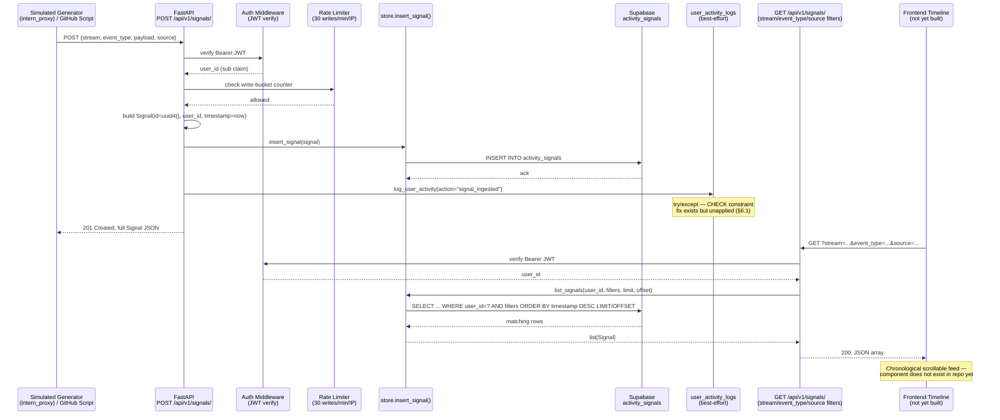

# Phase 3, Module 2: Activity Signals
## Technical Documentation — Data Ingestion, Implementation & Testing/Validation

**Repo:** `lpi-platform` · **Owner:** Adil Islam · **QA:** Daksh Garg / Jaivardhan Singh · **Demo Day:** June 27, 2026

> This document is written directly against the current state of `lpi-platform` (commit history through `20260615000000_signals_rls_and_log_action.sql`), not an idealized spec. Where the running code diverges from the Module 2 gate sheet, that gap is called out explicitly rather than smoothed over — you need to know what's actually shippable vs. what's still aspirational before demo day.

---

## 1. Phase Overview

### 1.1 Purpose

Activity Signals is the **evidence layer** of the LPI platform. A Goal (Phase 2) is a stated intention — *"I want to build a startup."* A Signal is proof of work toward it — *"Alice merged a PR."* Phase 4's recommendation engine (owned by Jaivardhan) reads Goals and Signals together to decide what a user should do next, give feedback, and watch for follow-up signals. Without this module, Phase 4 has goals with no evidence to reason against — it's a recommendation engine staring at an empty evidence locker.

### 1.2 Gate Condition (from the Module 2 spec sheet)

> **Gate:** API ingests simulated events. Activity timeline queryable by user and time range. Core path uses simulated data — real cross-stream data is bonus territory.

The spec sheet is explicit about *why*: other streams (Boardy, DataPro, VSAB, Altiostar) won't have stable APIs until their own Phase 3–4, so cross-stream ingestion is architecturally a *bonus*, not a blocker. The module has to stand on its own with **simulated events + intern profile data**.

Breaking the gate into testable conditions:

| Gate clause | Testable as |
|---|---|
| API ingests simulated events | `POST /api/v1/signals/` accepts a payload with `source: "simulated"` and persists it |
| Timeline queryable by user | `GET /api/v1/signals/` returns only the authenticated caller's rows |
| Timeline queryable by time range | `GET /api/v1/signals/?start=...&end=...` filters by `timestamp` |
| Core path = simulated | A generator script produces realistic signals without depending on any external stream |

The third row is flagged because, as covered in §4.3, **it is not yet implemented in the running code** — this is the single largest gap between the spec sheet and what currently ships.

### 1.3 Downstream Relevance

```
Goals (Phase 2)  ──┐
                    ├──→  Recommendation Engine (Phase 4)  ──→  Instructions, feedback,
Signals (Phase 3) ──┘                                          follow-up monitoring
```

Two design decisions in this module exist *specifically* to make Phase 4 easier later:

1. **`source` is a first-class field, added now rather than in Phase 4.** It lets the recommendation engine later run `GET /signals/?source=github_api` to weight verified real activity above simulated test data, without a breaking schema migration.
2. **There is intentionally no `goal_id` foreign key on signals.** Correlating "this signal is evidence for that goal" is a Phase 4 reasoning problem (semantic matching between a goal's description and a signal's payload), not a database constraint. Locking it to an FK now would force every signal to map to exactly one goal at ingest time, which doesn't reflect reality — one commit can be evidence for two goals, or none yet.

---

## 2. Data Model

### 2.1 Supabase Schema

```sql
-- supabase/migrations/20260611000000_create_activity_signals.sql

CREATE TABLE IF NOT EXISTS activity_signals (
    id          TEXT        PRIMARY KEY,              -- uuid4(), generated in Python
    user_id     TEXT        NOT NULL DEFAULT 'default_user',
    stream      TEXT        NOT NULL,                  -- WHICH domain: 'lpi', 'boardy', 'intern_proxy'...
    event_type  TEXT        NOT NULL,                  -- WHAT happened: 'pr_merged', 'match_created'...
    payload     JSONB       NOT NULL DEFAULT '{}',      -- event-specific data, schema varies by event_type
    source      TEXT        NOT NULL DEFAULT 'api',     -- HOW it arrived: 'github_api'|'manual'|'simulated'|'api'
    timestamp   TIMESTAMPTZ NOT NULL DEFAULT NOW()
);

CREATE INDEX IF NOT EXISTS idx_as_user_id    ON activity_signals (user_id);
CREATE INDEX IF NOT EXISTS idx_as_stream     ON activity_signals (stream);
CREATE INDEX IF NOT EXISTS idx_as_event_type ON activity_signals (event_type);
CREATE INDEX IF NOT EXISTS idx_as_source     ON activity_signals (source);
CREATE INDEX IF NOT EXISTS idx_as_timestamp  ON activity_signals (timestamp DESC);
```

**Why `stream` and `source` are separate columns** — this is the single most important modeling decision in the table, and it's easy to conflate the two:

- `stream` = the **business domain** the event is *about* (lpi, boardy, datapro). This is what the recommendation engine groups by when it asks "what's happened in the area this goal cares about?"
- `source` = **how the signal got into the database** (github_api, simulated, manual, api). This is what the recommendation engine uses to *weight confidence* — a `github_api` PR merge is stronger evidence than a `simulated` test event, even if both have `stream: "lpi"`.

Deliberately **no CHECK constraint** on either column. New streams (a future Boardy integration) or new event types onboard without a schema migration — the table grows with the product instead of gating it. The trade-off: nothing stops a typo (`"boardy"` vs `"boardy "`) from silently creating an orphan bucket; validation for known streams, if ever needed, belongs in the application layer, not the DB.

**No RLS at table creation** — RLS was added three days later in a follow-up migration (§2.3) after the auth PR landed. Worth noting because it's a real example of schema evolving alongside the rest of the system rather than being designed perfectly up front.

### 2.2 Pydantic Models

```python
# src/lpi/models.py

class SignalCreate(BaseModel):
    """Request body for POST /api/v1/signals/."""
    stream: str
    event_type: str
    payload: dict = {}
    source: str = "api"   # defaults to 'api' so untagged callers don't break


class Signal(SignalCreate):
    """Full signal — inherits SignalCreate fields + server-assigned ones."""
    id: str            # uuid.uuid4(), assigned in the router, not by Postgres
    user_id: str        # from the JWT 'sub' claim via get_current_user()
    timestamp: datetime  # datetime.now(UTC), assigned in the router
```

`Signal` inheriting from `SignalCreate` (rather than redefining all five fields) means anything added to `SignalCreate` — like `source` was — automatically shows up in `Signal` and in the `**signal.model_dump()` spread used to build the full object in the router. One inheritance edge, one field addition, zero duplicated maintenance.

### 2.3 RLS as Defense-in-Depth (not the primary gate)

```sql
-- supabase/migrations/20260615000000_signals_rls_and_log_action.sql
ALTER TABLE activity_signals ENABLE ROW LEVEL SECURITY;

CREATE POLICY "Users read own signals"   ON activity_signals FOR SELECT USING (auth.uid()::text = user_id);
CREATE POLICY "Users insert own signals" ON activity_signals FOR INSERT WITH CHECK (auth.uid()::text = user_id);
CREATE POLICY "Users update own signals" ON activity_signals FOR UPDATE USING (auth.uid()::text = user_id);
CREATE POLICY "Users delete own signals" ON activity_signals FOR DELETE USING (auth.uid()::text = user_id);
```

It's worth being precise about what this actually protects against: the FastAPI backend connects with the **service-role key**, which bypasses RLS entirely. The real authorization boundary is `Depends(get_current_user)` in the router (§3.3). RLS here only matters if the frontend (or anything else) ever queries Supabase **directly**, skipping the FastAPI layer — in that scenario, RLS is the only thing stopping cross-user reads. Don't mistake "RLS is enabled" for "the backend is enforcing per-user isolation" — those are two separate mechanisms protecting two separate attack surfaces.

---

## 3. Implementation

### 3.1 Ingest Endpoint — `POST /api/v1/signals/`

```python
# src/lpi/routers/signals.py

@router.post("/", response_model=Signal, status_code=status.HTTP_201_CREATED)
def ingest_signal(
    signal: SignalCreate,
    user_id: str = Depends(get_current_user),   # ① auth happens before the body even runs
) -> Signal:
    now = datetime.now(UTC)
    new_signal = Signal(
        id=str(uuid.uuid4()),        # ② server assigns the ID — caller never sets it
        user_id=user_id,             # ③ from the verified JWT, not from the request body
        timestamp=now,
        **signal.model_dump(),       # ④ stream, event_type, payload, source from the validated body
    )

    store.insert_signal(new_signal)  # ⑤ Supabase INSERT

    try:
        log_user_activity(           # ⑥ best-effort audit log — see §6.2 for the known issue here
            user_id=user_id, action="signal_ingested", resource_id=new_signal.id,
            metadata={"stream": new_signal.stream, "event_type": new_signal.event_type, "source": new_signal.source},
        )
    except Exception as exc:
        print(f"[ingest_signal] WARNING: logging failed for signal {new_signal.id}: {exc}")

    return new_signal
```

Walking the validation chain on a single request:

1. FastAPI deserializes the JSON body against `SignalCreate` *before* the function body runs. Missing `stream` or `event_type` → automatic `422 Unprocessable Entity`, no custom code needed.
2. `Depends(get_current_user)` resolves before the handler executes — an unauthenticated request never reaches the insert logic at all (§3.3).
3. **The `id`, `user_id`, and `timestamp` are never trusted from the client.** Even if a malicious caller puts `"user_id": "someone-else"` in the body, `SignalCreate` doesn't have a `user_id` field, so Pydantic silently drops it. This is the actual enforcement mechanism for "you can't write to another user's account" — it's not a runtime check, it's that the field doesn't exist on the input schema.
4. Logging is wrapped in `try/except` rather than allowed to propagate — see §6.2, this is currently masking a real schema bug rather than handling a genuinely optional side-effect.

### 3.2 Simulated Event Generation

This is the part of the gate the spec sheet calls the **core path**, and it's worth being direct about its current state: as of this writing, the simulated generator described in the Module 2 task table is a **design document, not yet a script**. The plan (`docs/aditi-proxy-data-plan.md`) defines the approach clearly:

- Real Deri/cross-stream data is blocked, so **intern profile data** (each intern's stated 3-year goal, interests, and skills) stands in as proxy ground truth.
- Each intern's skills/interests become signals with `stream: "intern_proxy"`:
  - one signal per skill → `event_type: "skill_demonstrated"`, `payload: {"skill": "<name>"}`
  - one signal per interest → `event_type: "interest_identified"`, `payload: {"interest": "<name>"}`
- Each intern's stated goals become `Goal` rows so the recommendation engine has something to correlate the signals against.

This is a genuinely better design than a naive random-event generator: it produces a feed that's internally consistent (an intern with `skills: ["python", "tensorflow"]` gets exactly those two `skill_demonstrated` signals, not arbitrary noise), which makes Phase 4's output far easier to sanity-check during a demo than fully synthetic data would be. The implementation gap is real, though — until that script lands, the "simulated event generator" row on the gate sheet is plan, not proof. Pseudocode for the conversion, matching the documented plan:

```python
# Planned: scripts/generate_intern_signals.py  (not yet implemented)

def intern_to_signals(intern: dict) -> list[dict]:
    """Convert one intern profile into SignalCreate-shaped dicts."""
    signals = []
    for skill in intern["skills"]:
        signals.append({
            "stream": "intern_proxy",
            "event_type": "skill_demonstrated",
            "payload": {"skill": skill},
            "source": "simulated",
        })
    for interest in intern["interests"]:
        signals.append({
            "stream": "intern_proxy",
            "event_type": "interest_identified",
            "payload": {"interest": interest},
            "source": "simulated",
        })
    return signals

# Then for each generated dict: requests.post(f"{API_BASE}/api/v1/signals/", json=signal, headers=auth_header)
```

### 3.3 Auth Middleware

```python
# src/lpi/middleware/auth.py

def get_current_user(credentials: HTTPAuthorizationCredentials | None = Depends(bearer_scheme)) -> str:
    if credentials is None:
        raise HTTPException(status_code=401, detail="Missing bearer token")

    token = credentials.credentials
    alg = jwt.get_unverified_header(token).get("alg")

    if alg == "HS256":
        key, algorithms = settings.supabase_jwt_secret, ["HS256"]      # legacy Supabase projects
    else:
        signing_key = _get_jwks_client().get_signing_key_from_jwt(token)
        key, algorithms = signing_key.key, ["ES256", "RS256"]          # current Supabase projects, via JWKS

    payload = jwt.decode(token, key, algorithms=algorithms, audience="authenticated")
    return payload["sub"]   # the Supabase auth user's UUID
```

This is **real JWT verification**, not a stub — it's the upgrade from the Phase 2 `"default_user"` placeholder. Two things worth understanding:

- It branches on the token's own `alg` header because Supabase signs tokens differently depending on project/CLI version (HS256 shared-secret on older projects, ES256/RS256 asymmetric on current ones, verified against the project's JWKS endpoint). Hardcoding one algorithm would silently break for whichever project type wasn't tested.
- `audience="authenticated"` is a deliberate check, not boilerplate — it rejects tokens issued for a different audience (e.g., a service-role token), so a leaked admin credential of the wrong type doesn't accidentally pass as a regular user.

### 3.4 Rate Limiting

```python
# src/lpi/middleware/rate_limit.py — fixed-window, per client IP, in-memory

_HEALTH_LIMIT, _WRITE_LIMIT, _READ_LIMIT = 120, 30, 60   # requests per 60s window

class RateLimitMiddleware(BaseHTTPMiddleware):
    async def dispatch(self, request, call_next):
        if request.method == "OPTIONS":
            return await call_next(request)   # CORS preflight is exempt

        limit_type, limit = (
            ("health", _HEALTH_LIMIT) if request.url.path == "/health" else
            ("write", _WRITE_LIMIT) if request.method in {"POST", "PATCH", "PUT", "DELETE"} else
            ("read", _READ_LIMIT)
        )
        allowed, retry_after = _check(_client_ip(request), limit_type, limit)
        if not allowed:
            return JSONResponse(status_code=429, content={"detail": "Rate limit exceeded. Please slow down."},
                                 headers={"Retry-After": str(retry_after)})
        return await call_next(request)
```

`POST /signals/` falls under the **write** bucket (30/min/IP) — meaningfully tighter than reads, because writes are the expensive side (DB insert + audit log) and the side most exposed to a runaway ingestion script hammering the endpoint in a loop. The known limitation, called out directly in the module's own docstring: state is an in-memory dict, single-process. It works correctly for the demo's single-instance deployment; it silently stops being a real limit the moment the service runs behind more than one worker process, since each worker would track its own counters. That's a Redis-backed-counter problem for whenever the platform scales past one process — not a Phase 3 blocker, but worth flagging now so it doesn't get rediscovered the hard way under load.

### 3.5 External (Bonus) Ingestion — GitHub Events

```python
# scripts/ingest_github_events.py

def map_github_event(event: dict) -> dict | None:
    """GitHub raw event → SignalCreate dict. Returns None for events we don't care about."""
    event_type = event.get("type", "")
    payload = event.get("payload", {})

    if event_type == "PullRequestEvent":
        pr = payload.get("pull_request", {})
        if payload.get("action") == "closed" and pr.get("merged", False):   # only MERGED PRs count
            return {
                "stream": "lpi", "event_type": "pr_merged", "source": "github_api",
                "payload": {"repo": event["repo"]["name"], "pr_number": pr.get("number"),
                            "title": pr.get("title", ""), "author": event["actor"]["login"]},
            }
        return None
    # ... PushEvent → commit_pushed, PullRequestReviewEvent → pr_reviewed,
    #     IssuesEvent (closed only) → issue_closed, CreateEvent (branch) → branch_created
```

This is the bonus path the gate sheet describes as "real cross-stream data... Boardy match events preferred." For demo day, real GitHub activity on `lpi-platform` itself stands in as the first real (non-simulated) stream, tagged `source: "github_api"` so it's distinguishable from `intern_proxy` simulated signals at query time.

**A real bug to fix before this script is demo-safe:** `post_signal()` POSTs with no `Authorization` header at all:

```python
def post_signal(signal_payload: dict) -> bool:
    url = f"{LPI_API_BASE}/api/v1/signals/"
    response = requests.post(url, json=signal_payload, timeout=5)   # ← no Authorization header
```

This worked fine against the Phase 2 `"default_user"` stub, but now that `ingest_signal` requires `Depends(get_current_user)`, every call from this script will 401 against an auth-enforced deployment. Fix is small (mint or reuse a service-account JWT and pass it as a bearer header) but it has to happen before this script is run against staging — right now it would *appear* to work locally only because local dev may still be running against an unenforced auth state, which is exactly the kind of gap that surfaces as a surprise during a live demo.

---

## 4. Query Layer — `GET /api/v1/signals/`

```python
@router.get("/", response_model=list[Signal])
def list_signals(
    stream: str | None = Query(default=None),
    event_type: str | None = Query(default=None),
    source: str | None = Query(default=None),
    limit: int = Query(default=50, ge=1, le=200),
    offset: int = Query(default=0, ge=0),
    user_id: str = Depends(get_current_user),
) -> list[Signal]:
    return store.list_signals(user_id=user_id, stream=stream, event_type=event_type,
                               source=source, limit=limit, offset=offset)
```

```python
# src/lpi/store.py

def list_signals(user_id=None, stream=None, event_type=None, source=None, limit=50, offset=0) -> list[Signal]:
    query = _get_client().table("activity_signals").select("*")
    if user_id:    query = query.eq("user_id", user_id)
    if stream:     query = query.eq("stream", stream)
    if event_type: query = query.eq("event_type", event_type)
    if source:     query = query.eq("source", source)
    query = query.order("timestamp", desc=True).limit(limit).offset(offset)
    return [Signal(**row) for row in query.execute().data]
```

### 4.1 Why filtering is server-side, not client-side

```python
# BAD  — fetches every row, filters in Python
all_rows = query.execute().data
return [s for s in all_rows if s["stream"] == stream]

# GOOD — Postgres only sends back matching rows; this is what the code does
query = query.eq("stream", stream)
```

At 50 signals the difference is invisible. At 10,000 signals, client-side filtering pulls all 10,000 rows over the network to discard 9,950 of them; server-side filtering, backed by `idx_as_stream`, returns exactly the 50 that match in roughly logarithmic time. This is the entire reason the migration adds one index per filterable column (§2.1) — an index without a corresponding `.eq()` filter in the store is dead weight, and a filter without a matching index is a full table scan waiting to happen at scale.

### 4.2 Pagination

`limit` and `offset` translate directly to SQL `LIMIT`/`OFFSET`. Querying page 2 of a `stream=boardy` filter (`?stream=boardy&limit=50&offset=50`) costs the same as page 1 regardless of total row count — Postgres never reads rows outside the requested window. The `idx_as_timestamp DESC` index means "sort newest-first" is also free; Postgres doesn't sort after fetching, it reads the index in its existing order.

### 4.3 Gap: Time-Range Filtering Is Not Yet Implemented

This is the most important discrepancy to flag against the gate sheet. The spec table lists *"Query endpoints: by user, by stream, by time range, by event type"* with done-state *"Flexible filtering, paginated results."* The running `list_signals` accepts `stream`, `event_type`, `source`, `limit`, `offset` — **there is no `start`/`end` query parameter, and `store.list_signals()` has no corresponding `.gte()`/`.lte()` call on `timestamp`.** The `idx_as_timestamp` index exists and would make a range filter fast once added, but the filter itself isn't wired up.

Concretely, this is what's missing and what closing it looks like:

```python
# Needed addition to GET /api/v1/signals/
start: datetime | None = Query(default=None, description="ISO-8601, inclusive lower bound"),
end:   datetime | None = Query(default=None, description="ISO-8601, inclusive upper bound"),

# Needed addition to store.list_signals()
if start: query = query.gte("timestamp", start.isoformat())
if end:   query = query.lte("timestamp", end.isoformat())
```

Given the gate sheet explicitly names "queryable by user and time range" as the success condition (not just by stream/event_type), this is a pre-demo blocker, not a nice-to-have — the timeline view (Jahanvi's frontend task) will likely want a "last 7 days" or "last 24 hours" view, which has no endpoint to call without this.

### 4.4 Bonus Endpoint — Single Signal Lookup

```python
@router.get("/{signal_id}", response_model=Signal)
def get_signal(signal_id: str, user_id: str = Depends(get_current_user)) -> Signal:
    signal = store.get_signal(signal_id)
    if signal is None or signal.user_id != user_id:
        raise HTTPException(status_code=404, detail=f"Signal '{signal_id}' not found.")
    return signal
```

Note the **404, not 403**, when the signal belongs to someone else. This mirrors the pattern already established in `goals.py`: returning 403 ("forbidden") leaks the fact that a resource with that ID exists at all; 404 keeps that information from a caller probing IDs they don't own. Small detail, but it's the kind of consistency worth preserving as new endpoints get added in Phase 4.

---

## 5. Execution Flow



**Step-by-step, in prose:**

1. **Generation** — either the (planned) intern-proxy script or the GitHub events script produces a `SignalCreate`-shaped payload and POSTs it.
2. **Auth gate** — `get_current_user` runs before any business logic. A bad or missing token never reaches the database.
3. **Rate gate** — the write-bucket counter is checked next; a script in a tight retry loop gets throttled with a `429` + `Retry-After` rather than hammering Supabase.
4. **Server-assigned fields** — `id`, `user_id`, `timestamp` are stamped in the router, never trusted from the caller.
5. **Persistence** — one `INSERT` into `activity_signals`, with the indexes from §2.1 already in place to make future reads fast.
6. **Audit log (best-effort)** — wrapped in `try/except` so a logging failure never blocks ingestion (currently masking the issue in §6.1, not just being defensive).
7. **Query side** — the frontend (or, eventually, Phase 4) calls `GET /signals/` with whatever filters it needs; everything happens server-side in one round trip.
8. **Frontend timeline** — this is where the flow currently ends on paper. The component itself isn't in the repo yet (Jahanvi's deliverable); the backend contract it would consume is otherwise ready, modulo §4.3.

---

## 6. Testing & Validation Strategy

### 6.1 Test Infrastructure

```python
# tests/conftest.py — the pattern every signals test relies on

@pytest.fixture(autouse=True)
def clear_store() -> Generator[None, None, None]:
    if not _supabase_available():
        pytest.skip("Local Supabase is not running. Start it with `supabase start`.")
    store.clear_all()
    clear_all_logs()
    yield
    store.clear_all()
    clear_all_logs()

@pytest.fixture
def client() -> TestClient:
    test_client = TestClient(app)
    test_client.headers.update({"Authorization": f"Bearer {_make_token()}"})  # real JWT, fixed test secret
    return test_client
```

Two things make this a solid foundation rather than a brittle one:

- **`autouse=True` on `clear_store`** means every test gets a clean table without remembering to call a cleanup helper — order-dependent test pollution (a classic flaky-suite cause) is structurally prevented.
- **The `client` fixture issues a real HS256 JWT** signed with a fixed test secret (`monkeypatch`-injected into `settings.supabase_jwt_secret`), rather than mocking `get_current_user` away. This means the auth middleware's actual decode/verify path runs in every test — a regression in JWT handling would be caught by the existing signal tests, not just a dedicated auth test file.

### 6.2 Current Coverage — `tests/test_activity_signals.py`

| Test | Validates |
|---|---|
| `test_ingest_returns_signal` | 201 status, server-assigned `id`/`timestamp`/`user_id`, `source` defaults to `"api"` |
| `test_ingest_with_explicit_source` | explicit `source` is preserved, not overwritten by the default |
| `test_ingest_from_different_streams` | no stream allowlist — `boardy`, `datapro`, `vsab`, `altiostar`, `security` all accepted |
| `test_list_signals_empty` | clean store → `[]`, not stale data from a prior test |
| `test_list_signals` | results scoped to the authenticated `user_id` — no cross-user leakage |
| `test_filter_by_stream` | `?stream=boardy` excludes a `datapro` signal inserted in the same test |
| `test_filter_by_source` | `?source=github_api` excludes a `simulated` signal — the exact filter Phase 4 needs |

### 6.3 Coverage Gaps to Close Before the Gate Is Truly Met

- **No `event_type` filter test**, even though the router exposes the parameter and the migration indexes it. Trivial to add by mirroring `test_filter_by_stream`.
- **No time-range test** — can't exist yet because the feature itself doesn't exist (§4.3). Once the `start`/`end` params are added, the test should insert signals with manually-set or mocked timestamps spanning a boundary and assert the boundary is inclusive/exclusive as documented.
- **No pagination test** — nothing currently asserts that `limit`/`offset` actually bound the result set (e.g., insert 60 signals, `limit=50`, assert exactly 50 come back and the 51st appears on `offset=50`).
- **No unauthenticated-request test specific to signals** — `test_rate_limit.py` exercises rate limiting, but there's no `test_activity_signals.py` case asserting a missing/invalid bearer token returns 401 *for this router specifically* (as opposed to relying on shared middleware tests elsewhere).
- **No test for the logging side-effect path** — given §6.1's known CHECK-constraint issue, a test that intentionally exercises the `signal_ingested` log write (rather than relying on the `try/except` to silently swallow it) would have caught the bug before it shipped to a migration fix.

### 6.4 The Known Blocker (Already Diagnosed, Not Yet Applied)

```sql
-- Already written in 20260615000000_signals_rls_and_log_action.sql, NOT yet pushed:
ALTER TABLE user_activity_logs DROP CONSTRAINT IF EXISTS user_activity_logs_action_check;
ALTER TABLE user_activity_logs ADD CONSTRAINT user_activity_logs_action_check
    CHECK (action IN ('goal_created', 'goal_updated', 'goal_deleted', 'signal_ingested'));
```

The original `user_activity_logs` CHECK constraint (from the Phase 2 logging migration) only permits `goal_created | goal_updated | goal_deleted`. Every `signal_ingested` log write currently violates that constraint and is silently caught by the `try/except` in `ingest_signal` — meaning **the audit trail for signal ingestion does not currently exist in the database**, even though the ingest endpoint itself works correctly. The fix is already written; it just needs `supabase db push` run against the target environment before this is considered closed. This is exactly the kind of "endpoint works, but a downstream side-effect silently fails" bug that integration tests against a real local Supabase instance (as this suite already does) are positioned to catch, once a test specifically exercises the log write rather than letting the try/except absorb it.

---

## 7. Completion Checklist

| Deliverable | Owner | Status | Notes |
|---|---|---|---|
| Activity signal model (schema + Pydantic) | Aditi | ✅ Done | `activity_signals` table + `SignalCreate`/`Signal` match the spec exactly |
| Ingest endpoint with validation | Adil | ✅ Done | Pydantic validation, JWT auth, server-assigned fields all in place |
| Simulated event generator (all 3 module types) | Aditi | 🟡 Planned, not coded | `docs/aditi-proxy-data-plan.md` defines the intern-proxy approach; script not yet written |
| Query endpoints — by user | Adil | ✅ Done | enforced via `Depends(get_current_user)` scoping, not optional |
| Query endpoints — by stream | Adil | ✅ Done | server-side `.eq()`, indexed |
| Query endpoints — by event type | Adil | ✅ Done | server-side `.eq()`, indexed, but no dedicated test yet |
| Query endpoints — by time range | Adil | 🔴 Not started | no `start`/`end` params on the router or store — see §4.3 |
| Query endpoints — pagination | Adil | ✅ Done | `limit`/`offset`, capped at 200, but untested |
| Timeline view (frontend) | Jahanvi | 🔴 Not started | no frontend code in the `lpi-platform` repo yet |
| Auth middleware on all endpoints | Jaivardhan | ✅ Done | real Supabase JWT verification (HS256 + ES256/RS256 via JWKS) |
| Rate limiting on all endpoints | Jaivardhan | ✅ Done | fixed-window per-IP, 30 writes/60 reads per minute |
| Webhook/polling design doc | Aditi | ⚪ Not reviewed in this pass | not located under `docs/` as of this writing |
| Unit + integration tests | Yashika | 🟡 Partial | ingest + stream/source filtering covered; event_type, pagination, time-range, auth-failure not yet covered |
| **Bonus:** real event data from another stream | Adil | 🟡 Partial, blocked | GitHub events script works end-to-end *except* it sends no auth header (§3.5) — will 401 once run against an auth-enforced deployment |

✅ Done · 🟡 Partial / in progress · 🔴 Not started · ⚪ Unverified in this review

---

## 8. Key Considerations

**Why simulated data is the right core path, not a shortcut.** Every other stream (Boardy, DataPro, VSAB, Altiostar) is on its own Phase 3–4 timeline — their APIs are explicitly described as unstable until then. Gating Module 2's success on real cross-stream integration would make this module's demo-readiness hostage to four other teams' schedules. The `source` field (§2.1) is the architectural hedge that makes this safe: simulated and real signals share one schema, one ingest path, and one query surface. When a real stream does come online, nothing about the ingestion pipeline changes — only the `source` value on incoming payloads does. This is the textbook case for designing the seam before you have both sides of it.

**Risk mitigation for unstable external APIs.** The GitHub ingestion script (§3.5) is the current external dependency, and it's structured defensively: GitHub API failures (`404`, `403` rate-limit) cause a clean exit with a printed cause rather than a stack trace, and each signal POST is wrapped so one failed insert doesn't abort the batch — the script reports a final `succeeded/failed` count and keeps going. The one gap that *isn't* defensive yet is the missing auth header (§3.5) — that's not a "what if GitHub is flaky" risk, it's a guaranteed failure the moment auth enforcement is live in the target environment, and it should be fixed before the script is pointed at anything but a local, auth-disabled instance.

**How the signal structure supports downstream goals analysis.** The lack of a `goal_id` FK (§1.3) is a deliberate bet that correlation belongs in Phase 4's reasoning layer, not the schema. The cost of that bet is that `recommendations.py` currently returns `[]` unconditionally — the correlation logic doesn't exist yet, so there's no way to verify in this phase that the bet pays off as intended. What *is* verifiable now: the `stream`/`event_type`/`source` triple gives Phase 4 enough to query "all real LPI-stream signals from the last week" without needing the FK at all, which is the access pattern the recommendation engine actually needs first (recent evidence in a domain) before it needs the finer-grained "evidence for this specific goal" correlation.

---

*Reviewed against the running `lpi-platform` codebase (models.py, store.py, routers/signals.py, middleware/auth.py, middleware/rate_limit.py, scripts/ingest_github_events.py, tests/test_activity_signals.py, and the four signals-related migrations) rather than written from the spec alone. The three items most worth fixing before demo day, in priority order: (1) wire up time-range filtering — it's named explicitly in the gate condition; (2) run `supabase db push` to apply the already-written CHECK constraint fix; (3) add an auth header to `ingest_github_events.py` before running it against anything but local/unauthenticated dev.*
