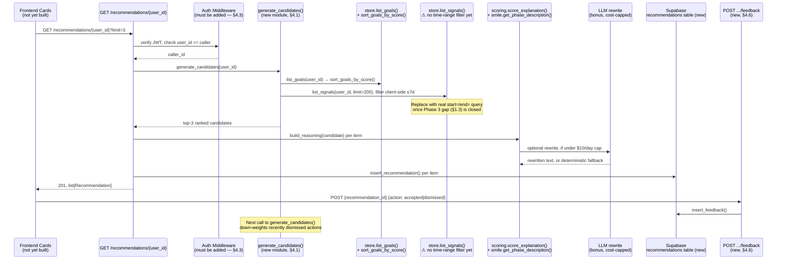

# Phase 4, Module 3: Recommendation Engine
## Implementation Plan — Data Model, Build Sequence & Testing/Validation

**Repo:** `lpi-platform` · **Owners:** Jaivardhan (algorithm + reasoning) · Adil (endpoint) · Jahanvi (frontend) · Daksh (agent orchestration) · Yashika (feedback + tests)

> **Status: not started.** Unlike the Phase 3 document, this is not a description of running code — `recommendations.py` is still the Phase 1/2 stub (`return []`), and `test_recommendations.py` is fully skipped. This document is a build plan: what has to be created, in what order, and — critically — using which pieces Phase 2 and Phase 3 already built so this phase isn't starting from zero. Every "how to build it" section below names the actual existing function it should call rather than describing a new one to write from scratch.

---

## 1. Phase Overview

### 1.1 Purpose

Phase 4 is where the platform stops being a system of record (goals + signals) and becomes a system of **advice**. Given a user's Goals (Phase 2) and Activity Signals (Phase 3), the engine has to surface three concrete next actions, explain *why* each one matters in SMILE terms, and learn from whether the user accepts or dismisses them.

### 1.2 Gate Condition

> **Gate:** Given a user's goals + activity signals → system suggests 3 next actions with SMILE-based reasoning. Frontend shows recommendation cards. Daksh's agent orchestration pipeline handles multi-step queries.

> **Bonus:** LLM-powered explanations (not just template-based), with per-call cost tracked. $10/day cap enforced in code.

Breaking the gate into testable conditions, the same way the Phase 3 document did:

| Gate clause | Testable as |
|---|---|
| Suggests 3 next actions | `GET /recommendations/{user_id}` returns a list of length ≤ 3, sorted by relevance |
| SMILE-based reasoning, specific not generic | Each `reasoning` string names the actual goal title and/or signal evidence it's based on — not a templated sentence with no per-user detail |
| Frontend shows recommendation cards | A card component renders `action`, `reasoning`, `smile_phase`, `priority` per item |
| Agent orchestration handles multi-step queries | A separate orchestration layer can chain goals→signals→actions for queries broader than "give me 3 actions" (e.g. "what should I focus on across all my goals this week") |
| Feedback loop | Accept/dismiss is persisted and measurably changes future output for that user |

### 1.3 Direct Continuity From Phase 3

This phase inherits two unresolved items from the Phase 3 document rather than starting clean, and both block specific Phase 4 tasks:

1. **Time-range query filtering on signals does not exist yet** (Phase 3 doc, §4.3). The recommendation algorithm's most natural question — *"what has this user done recently?"* — has no server-side way to ask "signals from the last 7 days." Closing that gap is now a **Phase 4 prerequisite**, not just a Phase 3 nice-to-have, because §4.1 below depends on it directly.
2. **The `recommendations.py` stub currently has no auth dependency at all** — `get_recommendations(user_id: str, limit: int = ...)` takes `user_id` as a path parameter with no `Depends(get_current_user)` anywhere. Once this returns real data instead of `[]`, that's an open endpoint serving anyone's recommendations to anyone who guesses their UUID. This has to be fixed as part of the endpoint work in §4.3, not treated as a separate hardening pass later.

---

## 2. What Already Exists vs. What Must Be Built

This is the most important table in this document — it's the difference between a 4-week build and a 1-week build.

| Already exists (reuse, don't rewrite) | Where | What's missing (must build) |
|---|---|---|
| `Recommendation` Pydantic model — `id, user_id, action, reasoning, smile_phase, priority, source_goals, source_signals, created_at` | `models.py` | A `store.insert_recommendation()` / `list_recommendations()` pair — recommendations are currently never persisted anywhere |
| SMILE-weighted goal scoring (`score_goal`, `score_explanation`, `sort_goals_by_score`) | `scoring.py` | Wiring this into a candidate-action generator — it currently only ranks goals, not actions |
| SMILE phase descriptions + key questions (`get_phase_description`, `get_phase_key_question`) | `smile.py` | Using these as the actual text source for "specific, not generic" reasoning, instead of writing new copy |
| Forward-one-step phase transition validation (`validate_phase_transition`) | `smile.py` | Reusing this to decide *when* "move to the next SMILE phase" is a valid recommendation vs. a skip |
| `store.list_goals(user_id, smile_phase)` and `store.list_signals(user_id, stream, event_type, source, limit, offset)` | `store.py` | A combined fetch step that pulls both per request, and a workaround for the missing time-range filter (§4.1) |
| `Recommendation.limit` query param already shaped for "top N" (`default=3, ge=1, le=10`) on the route stub | `routers/recommendations.py` | Auth dependency, real body, and persistence |
| `llm_provider`, `llm_model`, `daily_cost_cap_usd=10.0` settings fields | `config.py` | **These exist but are read by nothing.** No LLM client, no cost tracker, no enforcement — the bonus's hardest requirement is a config placeholder today |
| `X-Process-Time` response header, added specifically — per its own docstring — "to verify the <3s recommendation target" | `middleware/__init__.py` | An actual recommendation endpoint to measure; the SLA is already implied in the infra, it just has nothing to time yet |
| Dual-sync logging pattern (`log_user_activity`, `log_system_event`) — Supabase + in-memory, try/except wrapped | `utils/logging.py` | A fourth log type, or reuse of `log_user_activity`, for feedback events (§4.6) |
| Skipped test skeleton naming the exact gate behaviors to verify | `tests/test_recommendations.py` | The `phase_gate_enabled` fixture these tests reference **does not exist in `conftest.py` today** — un-skipping them will fail on a missing fixture until that's added (§6.1) |

---

## 3. Data Model Additions Needed

### 3.1 Recommendation — Already Modeled, Needs Persistence

```python
# models.py — already exists, no changes needed
class Recommendation(BaseModel):
    id: str
    user_id: str
    action: str
    reasoning: str
    smile_phase: SmilePhase
    priority: float
    source_goals: list[str] = []
    source_signals: list[str] = []
    created_at: datetime
```

The model is gate-ready as written. What's missing is a place for it to live. Right now there is no `recommendations` table and no `store.insert_recommendation()` — every call to the endpoint would have to recompute from scratch with no record of what was shown before. That's a problem the moment feedback enters the picture: §4.6 needs to say "the user dismissed *recommendation X*," which requires recommendation X to have a durable `id` a feedback row can point to. **Decision to make explicitly before building:** persist every generated recommendation (cheap — it's a small JSON row) rather than trying to make feedback reference an ephemeral, never-stored object.

```sql
-- New migration needed: 2026MMDD000000_create_recommendations.sql
CREATE TABLE IF NOT EXISTS recommendations (
    id            TEXT        PRIMARY KEY,
    user_id       TEXT        NOT NULL,
    action        TEXT        NOT NULL,
    reasoning     TEXT        NOT NULL,
    smile_phase   TEXT        NOT NULL,
    priority      DOUBLE PRECISION NOT NULL,
    source_goals  JSONB       NOT NULL DEFAULT '[]',
    source_signals JSONB      NOT NULL DEFAULT '[]',
    created_at    TIMESTAMPTZ NOT NULL DEFAULT NOW()
);
CREATE INDEX IF NOT EXISTS idx_rec_user_id    ON recommendations (user_id);
CREATE INDEX IF NOT EXISTS idx_rec_created_at ON recommendations (created_at DESC);
```

Mirrors the `activity_signals` migration pattern exactly (§2.1 of the Phase 3 document) — same column-naming convention, same one-index-per-filter-column approach, same `TEXT` primary key generated in Python.

### 3.2 Feedback — Net New

The gate names this explicitly: *"accept/dismiss recommendation → influences future suggestions... Feedback stored, affects next recommendations."*

```sql
-- New migration: 2026MMDD000001_create_recommendation_feedback.sql
CREATE TABLE IF NOT EXISTS recommendation_feedback (
    id                TEXT        PRIMARY KEY,
    recommendation_id TEXT        NOT NULL REFERENCES recommendations(id),
    user_id           TEXT        NOT NULL,
    action            TEXT        NOT NULL CHECK (action IN ('accepted', 'dismissed')),
    created_at        TIMESTAMPTZ NOT NULL DEFAULT NOW()
);
CREATE INDEX IF NOT EXISTS idx_rf_user_id ON recommendation_feedback (user_id);
```

```python
# models.py addition needed
class FeedbackCreate(BaseModel):
    action: Literal["accepted", "dismissed"]

class Feedback(FeedbackCreate):
    id: str
    recommendation_id: str
    user_id: str
    created_at: datetime
```

This *is* allowed a `recommendation_id` foreign key — unlike the deliberate choice to leave `goal_id` off `activity_signals` (Phase 3 doc, §1.3). The reasoning is different here: a signal can be evidence for zero or several goals, which is exactly why that correlation was left to application logic. Feedback, by contrast, is *always* about exactly one specific recommendation that was actually shown — there's no ambiguity to defer, so the FK is the right call.

### 3.3 LLM Usage Log — Bonus Only

Needed only if the LLM-powered-explanations bonus is attempted. Without this table, `daily_cost_cap_usd` stays an unenforced number in `config.py`.

```sql
-- New migration, bonus scope only
CREATE TABLE IF NOT EXISTS llm_usage_log (
    id          TEXT        PRIMARY KEY,
    user_id     TEXT        NOT NULL,
    model       TEXT        NOT NULL,
    input_tokens  INTEGER   NOT NULL,
    output_tokens INTEGER   NOT NULL,
    cost_usd      DOUBLE PRECISION NOT NULL,
    created_at  TIMESTAMPTZ NOT NULL DEFAULT NOW()
);
CREATE INDEX IF NOT EXISTS idx_llm_created_at ON llm_usage_log (created_at);
```

---

## 4. Implementation Plan, By Gate Task

### 4.1 Recommendation Algorithm — Owner: Jaivardhan

**What it has to do:** turn a user's goals + recent signals into ranked candidate actions.

**How to build it, reusing what exists:**

```python
# Proposed: src/lpi/recommendation_engine.py (new module)

from lpi import store
from lpi.scoring import sort_goals_by_score, score_goal
from lpi.smile import PHASE_ORDER, validate_phase_transition, get_phase_description

def generate_candidates(user_id: str) -> list[dict]:
    """Produce ranked candidate actions for one user.

    Step 1 — fetch ranked goals. Reuses Phase 2's scoring exactly as-is;
    no new ranking logic needed for "which goal matters most right now."
    """
    goals = store.list_goals(user_id=user_id)
    ranked_goals = sort_goals_by_score(goals)   # existing function, zero changes

    """
    Step 2 — fetch recent signals.
    KNOWN GAP (Phase 3 doc §4.3): there is no server-side time-range filter yet.
    Interim workaround until that's closed: pull a generously large page,
    sorted newest-first (already the default order from store.list_signals),
    and filter client-side on `timestamp` here. This is the client-side
    anti-pattern the Phase 3 doc warns against for production scale — it is
    acceptable ONLY as a temporary measure, and should be replaced with a
    real `start=`/`end=` query the moment that gap is closed.
    """
    all_recent = store.list_signals(user_id=user_id, limit=200)
    cutoff = datetime.now(UTC) - timedelta(days=7)
    recent_signals = [s for s in all_recent if s.timestamp >= cutoff]

    candidates = []
    for goal in ranked_goals:
        # Has this goal seen ANY signal evidence at all (any stream/event_type)?
        # A real implementation matches signal.payload content against
        # goal.description — left intentionally simple here; this is the
        # single biggest place to invest follow-up engineering effort.
        has_recent_evidence = any(
            True for s in recent_signals  # naive: any recent signal counts as activity
        )

        if not has_recent_evidence:
            # No evidence in the window → recommend an action, not a phase change
            candidates.append({
                "goal": goal,
                "action": f"Log progress on '{goal.title}' — no activity signal in 7 days",
                "smile_phase": goal.smile_phase,
                "priority": score_goal(goal),
                "source_goals": [goal.id],
                "source_signals": [],
            })
        else:
            # Evidence exists → is advancing to the next SMILE phase valid?
            current_idx = PHASE_ORDER.index(goal.smile_phase)
            if current_idx + 1 < len(PHASE_ORDER):
                next_phase = PHASE_ORDER[current_idx + 1]
                if validate_phase_transition(goal.smile_phase, next_phase):
                    candidates.append({
                        "goal": goal,
                        "action": f"Consider advancing '{goal.title}' to {next_phase.value}",
                        "smile_phase": next_phase,
                        "priority": score_goal(goal),
                        "source_goals": [goal.id],
                        "source_signals": [s.id for s in recent_signals][:5],
                    })

    # Step 3 — rank candidates, return top N (default 3, matches the gate)
    candidates.sort(key=lambda c: -c["priority"])
    return candidates[:3]
```

This is deliberately scoped as a **starting algorithm, not a finished one** — the "has this goal seen evidence" check above is naive on purpose (it doesn't yet match a signal's `payload`/`stream` against a goal's actual subject matter). That matching step is the real intellectual core of the recommendation engine and the part most worth iterating on; everything else in this function is plumbing that already existed in Phase 2/3 and just needed to be called in sequence.

### 4.2 SMILE-Based Reasoning — Owner: Jaivardhan

**The gate's actual bar:** *"Explanations are specific, not generic."* This is exactly what `scoring.score_explanation()` was already built for — its own docstring says so directly: *"Used by the Phase 4 recommendation engine to produce transparent reasoning."* Phase 2 wrote this for Phase 4 to use; Phase 4 should use it rather than inventing a parallel explanation system.

```python
from lpi.scoring import score_explanation
from lpi.smile import get_phase_description, get_phase_key_question

def build_reasoning(candidate: dict) -> str:
    goal = candidate["goal"]
    # Reuse Phase 2's per-goal score breakdown verbatim — it already names
    # the goal's actual priority, phase, and urgency numbers, which is what
    # makes it "specific" rather than templated boilerplate.
    base = score_explanation(goal)

    # Layer the SMILE phase's key question on top — ties the recommendation
    # back to the methodology's own framing, not just a numeric score.
    question = get_phase_key_question(candidate["smile_phase"])
    return f"{base} Next-phase question to consider: {question}"
```

This single change — calling existing Phase 2 functions instead of writing new copy — is what turns "generic" into "specific" without any new design work: `score_explanation()` already interpolates the real goal title, real priority number, and real phase weight into its sentence.

### 4.3 Recommendation Endpoint — Owner: Adil

```python
# routers/recommendations.py — replacing the [] stub

@router.get("/{user_id}", response_model=list[Recommendation])
def get_recommendations(
    user_id: str,
    limit: int = Query(default=3, ge=1, le=10),
    caller_id: str = Depends(get_current_user),   # ← MUST be added; absent today
) -> list[Recommendation]:
    """Return up to `limit` ranked recommendations for `user_id`.

    SECURITY FIX vs. current stub: the path `user_id` and the authenticated
    `caller_id` are two different things. Without this check, any
    authenticated user could request any OTHER user's recommendations by
    guessing their UUID in the URL — there is currently nothing stopping
    that once this returns real data instead of [].
    """
    if user_id != caller_id:
        raise HTTPException(status_code=status.HTTP_404_NOT_FOUND, detail="Not found")
        # 404, not 403 — same information-hiding pattern goals.py and
        # signals.py already use (Phase 3 doc §4.4): don't confirm or deny
        # that a different user_id exists.

    candidates = generate_candidates(user_id)
    recommendations = [
        Recommendation(
            id=str(uuid.uuid4()), user_id=user_id, action=c["action"],
            reasoning=build_reasoning(c), smile_phase=c["smile_phase"],
            priority=c["priority"], source_goals=c["source_goals"],
            source_signals=c["source_signals"], created_at=datetime.now(UTC),
        )
        for c in candidates[:limit]
    ]
    for rec in recommendations:
        store.insert_recommendation(rec)   # persist — feedback needs the id (§3.1, §4.6)

    return recommendations
```

`store.insert_recommendation()` doesn't exist yet either — it's a one-function addition to `store.py`, identical in shape to `insert_signal()` (Phase 3 doc §3.1): build a dict via `model_dump(mode="json")`, `.table("recommendations").insert(...)`.

### 4.4 Frontend Recommendation Cards — Owner: Jahanvi

The contract this depends on is already fully specified by the `Recommendation` model — `action`, `reasoning`, `smile_phase`, `priority` map directly onto the gate's "Cards show: action, why, SMILE phase, priority" requirement with no translation layer needed. As with the Phase 3 timeline view, **no frontend code exists in this repo yet** — this is the second frontend deliverable stacked on the same unstarted foundation, so the two should likely be planned together rather than as fully separate efforts once frontend work begins.

### 4.5 Agent Orchestration — Owner: Daksh

**Open dependency to resolve first:** the gate references "chosen framework from Phase 1," but `pyproject.toml` currently has no agent/LLM orchestration dependency at all (no LangGraph, no equivalent). This needs to be confirmed against whatever Phase 1 planning artifact made that choice before any code is written here — building against the wrong assumption is more expensive to unwind than spending an hour confirming it now.

**Scope boundary worth setting explicitly**, because the gate's own wording draws it: §4.1's `generate_candidates()` is the deterministic core that satisfies *"given goals + signals → 3 actions."* Agent orchestration is described as handling *"complex multi-step queries"* — a different, broader job (e.g. "what should I prioritize across all my goals this week, accounting for what I dismissed last time"). The clean design is **the algorithm as a callable tool the agent can invoke**, not a rewrite of the algorithm in agent form:

```python
# Conceptual shape — concrete implementation depends on the confirmed framework
tools = [
    Tool(name="get_ranked_goals", fn=lambda uid: sort_goals_by_score(store.list_goals(user_id=uid))),
    Tool(name="get_recent_signals", fn=lambda uid, days: [...]),  # same gap as §4.1
    Tool(name="generate_candidates", fn=generate_candidates),     # §4.1, reused directly
    Tool(name="explain_smile_phase", fn=get_phase_description),
]
```

This keeps the single-call gate path (§4.3) fast and dependency-free, while the multi-step path can compose the same building blocks through whichever framework Phase 1 settled on.

### 4.6 User Feedback Loop — Owner: Yashika

```python
# New endpoint, e.g. POST /api/v1/recommendations/{recommendation_id}/feedback

@router.post("/{recommendation_id}/feedback", response_model=Feedback, status_code=201)
def submit_feedback(
    recommendation_id: str, feedback: FeedbackCreate,
    user_id: str = Depends(get_current_user),
) -> Feedback:
    new_feedback = Feedback(id=str(uuid.uuid4()), recommendation_id=recommendation_id,
                             user_id=user_id, action=feedback.action, created_at=datetime.now(UTC))
    store.insert_feedback(new_feedback)
    # Same dual-sync, never-break-the-endpoint pattern as log_user_activity (Phase 3 doc §3.1)
    log_user_activity(user_id=user_id, action="recommendation_feedback",
                       resource_id=recommendation_id, metadata={"action": feedback.action})
    return new_feedback
```

**"Influences future suggestions" — the simplest mechanism that actually satisfies this:** in `generate_candidates()` (§4.1), before ranking, look up recent dismissals for the user and down-weight (or skip) candidates whose `action` text matches a recently-dismissed one closely enough. This doesn't need to be sophisticated to pass the gate — it needs to be *demonstrable*: dismiss a recommendation, call the endpoint again, show the same suggestion doesn't reappear immediately. A more sophisticated version (adjusting `PHASE_WEIGHT`/`PRIORITY_WEIGHT`-style learned weights per user) is a reasonable post-gate iteration, not a Phase 4 demo requirement. Note that `user_activity_logs`' CHECK constraint (Phase 3 doc §6.4) will need a similar follow-up if `"recommendation_feedback"` is added as an action value there too — same class of bug, worth fixing in the same migration pass rather than rediscovering it the same way.

### 4.7 Unit Tests for Recommendation Logic — Owner: Yashika

Covered in depth in §6 below — the test file already exists with the right test names; it's the implementation and one missing fixture that are blocking it.

### 4.8 Bonus — LLM-Powered Explanations With Cost Cap

**Why this is correctly scoped as bonus, not core:** the deterministic reasoning in §4.2 already satisfies "specific, not generic" using real numbers and real goal/phase text — it does not require an LLM call to pass the gate. The bonus is specifically about *quality of prose*, not correctness, which is exactly the kind of enhancement that should degrade gracefully rather than become a dependency.

```python
# Proposed shape — wraps §4.2's deterministic output as the floor, never the ceiling's only path

DAILY_CAP = settings.daily_cost_cap_usd   # 10.0 — already in config.py, currently unused anywhere

def build_reasoning(candidate: dict, allow_llm: bool = True) -> str:
    deterministic = _deterministic_reasoning(candidate)   # §4.2, always computed first

    if not allow_llm or _today_cost_usd() >= DAILY_CAP:
        return deterministic   # cap hit, or LLM disabled → fall back, never fail the request

    try:
        response = llm_client.rewrite(deterministic)       # one call, one user-facing rewrite
        _log_llm_usage(tokens_in=response.usage.input_tokens,
                       tokens_out=response.usage.output_tokens,
                       cost_usd=response.cost)              # writes to llm_usage_log (§3.3)
        return response.text
    except Exception:
        return deterministic   # same "logging/LLM failure never breaks the endpoint" pattern
                                # already established in logging.py and signals.py
```

`_today_cost_usd()` sums `llm_usage_log.cost_usd` for the current UTC day — a single `SELECT SUM(cost_usd) WHERE created_at >= today` query, checked **before** the LLM call, not after, so the cap is actually preventative rather than just an after-the-fact reading. This is also where the `<3s` target from `TimingMiddleware`'s own docstring (§2) becomes a real constraint: an LLM call needs a tight timeout (suggest ≤1.5s) with the deterministic fallback firing on timeout, not just on cap-exceeded — a slow LLM call should never be the reason a recommendation request blows its latency budget.

---

## 5. Execution Flow



---

## 6. Testing & Validation Strategy

### 6.1 Fix Before Anything Else: the Missing Fixture

`tests/test_recommendations.py` already references `phase_gate_enabled` as a fixture argument:

```python
def test_get_recommendations(self, client, phase_gate_enabled: bool) -> None:
```

**`phase_gate_enabled` does not exist in `conftest.py` today.** Until it's added, un-skipping these tests will fail at fixture resolution before the test body even runs — a pytest error, not a clean skip. The fix is small and should land before any other Phase 4 test work:

```python
# conftest.py addition needed
import os

@pytest.fixture
def phase_gate_enabled() -> bool:
    return os.environ.get("LPI_RUN_PHASE_GATES") == "1"
```

This matches the env var name (`LPI_RUN_PHASE_GATES`) already referenced in the test docstrings and in `docs/notes/phase3_signals_prep.md`'s implementation notes — the convention was established, just never wired into a fixture.

### 6.2 Existing Test Skeleton — What Each One Will Actually Require

| Test | Currently | To make it pass |
|---|---|---|
| `test_get_recommendations` | skipped unless `LPI_RUN_PHASE_GATES=1` | Needs §4.3's endpoint, plus `sample_goal`/`sample_signal` fixtures seeded beforehand (the existing fixtures from Phase 2/3's `conftest.py` work as-is) |
| `test_recommendations_have_reasoning` | `pytest.skip("Implement after goals + signals exist")` | Goals and signals already exist (Phase 2/3 shipped) — this skip reason is now stale; the real blocker is §4.2's `build_reasoning()` |
| `test_recommendations_reference_smile_phase` | `pytest.skip("Implement after recommendation engine built")` | Assert `recommendation.smile_phase` is a valid `SmilePhase` enum value present in `PHASE_ORDER` |
| `test_max_3_recommendations` | gated, same pattern as the first | Trivial once §4.3 respects `limit` — already shaped correctly in the stub signature |

### 6.3 New Tests Needed, Not Yet Skeletoned

- **Auth enforcement on the new endpoint** — a test asserting `user_id != caller_id` returns 404, mirroring the existing pattern in `test_goal_crud.py`'s ownership checks. This is the one true new piece of attack-surface in this phase (§1.3) and deserves its own explicit test, not just incidental coverage.
- **Algorithm unit tests, isolated from Supabase** — `generate_candidates()` and `build_reasoning()` are pure-ish functions once goals/signals are passed in directly (not fetched). Following `test_scoring.py`'s existing pattern (pure functions, no DB, no client fixture needed) makes these fast and reliable: feed in a fixed list of `Goal`/`Signal` objects, assert on the returned candidates' `action` and `priority` fields.
- **Feedback influencing future output** — insert a recommendation, submit a `dismissed` feedback, call `generate_candidates()` again, assert the dismissed action doesn't reappear. This is the actual gate condition ("feedback... affects next recommendations") and currently has no test anywhere.
- **Cost-cap enforcement (bonus scope)** — seed `llm_usage_log` with rows summing to ≥ $10 for today, call `build_reasoning()` with `allow_llm=True`, assert the LLM path is skipped and the deterministic fallback is returned. Also test the timeout-fallback path independently of the cap path — these are two different failure modes and should not share one test.
- **Latency target** — given `TimingMiddleware` already exists specifically to surface `X-Process-Time` for this purpose, add a test asserting the header is present and under 3000ms on a recommendation call with the LLM path both enabled and disabled, so a slow bonus feature doesn't silently regress the core gate's performance bar.

---

## 7. Completion Checklist

| Deliverable | Owner | Status | Depends on |
|---|---|---|---|
| Recommendation algorithm (goals + signals → candidates) | Jaivardhan | 🔴 Not started | `store.list_goals`/`list_signals` (exist) + Phase 3 time-range gap (workaround viable, real fix preferred) |
| SMILE-based reasoning (specific, not generic) | Jaivardhan | 🔴 Not started | `scoring.score_explanation()`, `smile.get_phase_description()`/`get_phase_key_question()` — all exist, just need calling |
| `recommendations` table + `store.insert_recommendation`/`list_recommendations` | Jaivardhan / Adil | 🔴 Not started | New migration (§3.1) — no schema or store function exists yet |
| Recommendation endpoint with auth | Adil | 🔴 Not started | Must add `Depends(get_current_user)` — currently absent on this route entirely (§1.3) |
| Frontend recommendation cards | Jahanvi | 🔴 Not started | Endpoint contract (above); no frontend code exists in-repo for Phase 3's timeline either — same blocker class |
| Agent orchestration (multi-step queries) | Daksh | 🔴 Not started, blocked | Framework choice from Phase 1 not confirmed in this codebase — `pyproject.toml` has zero agent/LLM SDK dependencies today |
| User feedback loop | Yashika | 🔴 Not started | New `recommendation_feedback` table (§3.2); down-weighting logic in §4.1 |
| Unit tests for recommendation logic | Yashika | 🟡 Skeleton exists, all skipped | Missing `phase_gate_enabled` fixture (§6.1) blocks even running the gated ones |
| **Bonus:** LLM explanations, cost-tracked, $10/day cap | Jaivardhan (+Adil for wiring) | 🔴 Not started | `llm_provider`/`llm_model`/`daily_cost_cap_usd` already in `config.py` but read by nothing; needs `llm_usage_log` table + the cap-check-before-call logic in §4.8 |

✅ Done · 🟡 Partial / in progress · 🔴 Not started

**Recommended build order**, based purely on dependency chains above, not owner availability:

1. `recommendations` table + `store` functions (§3.1) — everything else writes through this
2. Endpoint with auth fix (§4.3) + algorithm (§4.1) + reasoning (§4.2) — this alone satisfies the core gate
3. `phase_gate_enabled` fixture (§6.1) — unblocks running the existing test skeleton against step 2
4. Feedback table + endpoint + down-weighting (§3.2, §4.6) — second gate clause, independent of frontend/agent work
5. Frontend cards (§4.4) — can start as soon as step 2's response shape is stable, doesn't need to wait for 3–4
6. Agent orchestration (§4.5) — gated on confirming the Phase 1 framework choice; can proceed in parallel with 3–5 once unblocked
7. LLM bonus (§4.8) — last, by design; it's additive and every other step already works without it

---

## 8. Key Considerations

**This phase's biggest risk is invisible until step 2 ships: the missing auth check.** Every other endpoint in this codebase (`goals.py`, `signals.py`) enforces `user_id != caller_id → 404` from day one. The recommendation stub never got that treatment because it never returned real data to protect. The moment §4.1–4.3 land, this becomes a live cross-user data leak if the fix in §4.3 is skipped or deferred "for later" — it should be written in the same commit as the real algorithm, not as a follow-up PR.

**The <3s latency target is not a new requirement invented for this phase — it's already encoded in infrastructure that's been live since Phase 2.** `TimingMiddleware`'s own docstring states its `X-Process-Time` header exists specifically to verify this target. That means the bar was set before this module existed, and the bonus LLM path (§4.8) is the one piece of this phase actually at risk of breaking it — which is exactly why §4.8 specifies a tight LLM timeout with deterministic fallback rather than letting a slow external API call become the response time.

**The cost cap is the bonus's only hard requirement, and it's currently zero percent enforced despite looking configured.** `daily_cost_cap_usd: float = 10.0` sitting in `config.py` reads like the cap already exists — it doesn't; nothing in the codebase queries it. Treat that field as a placeholder the bonus work fulfills, not as evidence the bonus is partially done.

**Connection back to Phase 3, restated plainly:** this phase cannot fully satisfy its own gate (3 actions grounded in goals *and signals*) until Phase 3's time-range filtering gap is closed, because "recent activity" is the natural lens for "what should I do next." The workaround in §4.1 (fetch a large page, filter client-side) is explicitly a stopgap — it works for a demo at current data volumes, and stops being acceptable the moment either module has real production traffic, for the same reason the Phase 3 document gives for preferring server-side filtering in the first place.

---

*Reviewed against the running `lpi-platform` codebase (models.py, scoring.py, smile.py, store.py, routers/recommendations.py, routers/goals.py, middleware/__init__.py, config.py, tests/test_recommendations.py, tests/conftest.py) — none of which contain a working recommendation algorithm yet, which is why this document is a build plan rather than an as-built description. The three items most worth resolving before any other Phase 4 work starts: (1) add the missing auth check to the recommendation endpoint before it serves real data; (2) add the `phase_gate_enabled` fixture so the existing test skeleton can even run; (3) confirm the agent orchestration framework from Phase 1 with Daksh before writing any orchestration code against an assumed choice.*
